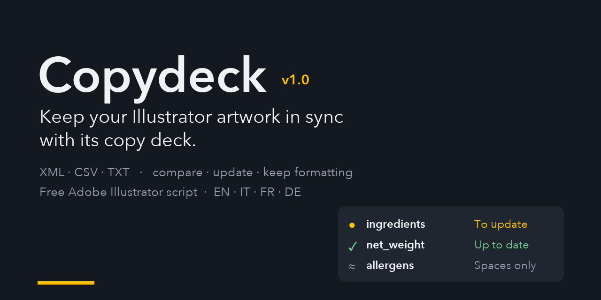

# Copydeck – update Adobe Illustrator text variables from XML, CSV and TXT

[](https://github.com/spacefilling/copydeck/releases/latest)
[](LICENSE)


**Keep your Illustrator artwork in sync with its copy deck.** Copydeck is a free, open source (GPL-3.0) script for Adobe Illustrator that compares the text variables of an `.ai` file with a data file (Illustrator Variable Library XML, CSV or tab-delimited TXT), shows exactly what changed and updates the texts one by one or all together, **without losing formatting**.

**Website and manual:** [spacefilling.github.io/copydeck](https://spacefilling.github.io/copydeck/) · [Italiano](https://spacefilling.github.io/copydeck/it/) · [Français](https://spacefilling.github.io/copydeck/fr/) · [Deutsch](https://spacefilling.github.io/copydeck/de/)

**Download:** [Copydeck.jsx (latest release)](https://github.com/spacefilling/copydeck/releases/latest/download/Copydeck.jsx)



## Why Copydeck

A *copy deck* is the document with every text of a pack, label or campaign: product name, ingredients, nutrition table, allergens, legal notes, claims. Illustrator can import such data through its Variables panel and data merge, but it does not show what changed, it binds each variable to a single object, and applying a data set rewrites the whole text with its formatting.

Copydeck keeps Illustrator's own variables and adds a clear, safe workflow on top of them. It is made for **packaging and label design**, agencies working from a client's copy deck, catalogues and price lists built with **Illustrator data merge**, and **multilingual packaging**.

## Features

- **Comparison view** – every variable with its status (to update, up to date, not bound, new in file, not in file), the text in the document, the text in the file and the exact part that will change.
- **Updates that keep formatting** – only the words that differ are replaced, so bold, colours and character styles of the rest of the text are kept. Optionally your manual spaces and line breaks are kept too.
- **Ignore what does not matter** – differences in spaces and line breaks (and, optionally, upper/lower case) are not counted as changes. Formatting never is.
- **Update one, some or all variables**, with undo of the last update.
- **Remembers the source** – the linked data file and, for every variable, the file and record it was last updated from are stored inside the `.ai` file (XMP metadata).
- **Binding tools** – searchable lists of text objects and variables, pick the object on the artboard, bind the current selection, create a variable from a text.
- **Auto-match** – proposes bindings for objects whose text already equals a variable's value; doubtful cases are listed but not preselected.
- **One variable on several objects** – extra objects are bound through a `VAR:name` line in the object's Note, which also travels with the object when you copy the artwork to another document.
- **XML, CSV and TXT** – Illustrator Variable Library XML (`<p>`, `<br/>`, `<b>`, `<i>`) and CSV/TXT in the format of Illustrator data merge and VariableImporter (`@` image, `#` visibility, `%` graph columns). Delimiter and encoding (UTF-8, UTF-16, Windows-1252) are detected automatically.
- **Interface in English, Italian, French and German.**

## Installation

1. Download [`Copydeck.jsx`](https://github.com/spacefilling/copydeck/releases/latest/download/Copydeck.jsx).
2. Copy it into Illustrator's Scripts folder:
   - Windows: `C:\Program Files\Adobe\Adobe Illustrator <version>\Presets\<language>\Scripts\`
   - macOS: `/Applications/Adobe Illustrator <version>/Presets.localized/<language>/Scripts/`
3. Restart Illustrator. The script appears in **File > Scripts > Copydeck**.

You can also run it without installing it: **File > Scripts > Other Script…**. A keyboard shortcut makes the *Pick on artboard* workflow much faster: the [manual](https://spacefilling.github.io/copydeck/manual/#keyboard-shortcut) explains how to assign one with an action.

## Quick start

1. Open your `.ai` file and run Copydeck.
2. Press **Choose data file…** and pick your XML, CSV or TXT.
3. In **Variables and comparison**, check the rows marked **● To update**.
4. Press **Update this one** or **Update all variables to update**.
5. Save the `.ai` file.

To bind texts to variables, use **Auto-match…** or the **Text objects** tab.

## Data file formats

**XML** – the file Illustrator writes with *Variables panel > Save Variable Library*. Every `sampleDataSet` is a record.

**CSV / TXT** – the first row holds the variable names, every following row is a record:

```csv
product_name,net_weight,ingredients,@photo,#show_badge
Tomato soup,500 g,"Tomatoes 85%, water, olive oil, salt",/images/tomato.jpg,TRUE
Pea soup,400 g,"Peas 70%, water, CELERY\\Cooked in a facility that also handles MUSTARD.",/images/pea.jpg,FALSE
```

- `@name` image, `#name` visibility, `%name` graph (listed, managed by Illustrator)
- a line break inside a quoted cell, or `\\`, starts a new paragraph

Sample files: [`examples/`](examples/).

## Documentation

| Language | Overview | Manual |
| --- | --- | --- |
| English | [Copydeck](https://spacefilling.github.io/copydeck/) | [Manual](https://spacefilling.github.io/copydeck/manual/) |
| Italiano | [Copydeck](https://spacefilling.github.io/copydeck/it/) | [Manuale](https://spacefilling.github.io/copydeck/it/manuale/) |
| Français | [Copydeck](https://spacefilling.github.io/copydeck/fr/) | [Manuel](https://spacefilling.github.io/copydeck/fr/manuel/) |
| Deutsch | [Copydeck](https://spacefilling.github.io/copydeck/de/) | [Handbuch](https://spacefilling.github.io/copydeck/de/handbuch/) |

Inside the script, **How it works** gives a short guide in the selected language.

## Where things are stored

| What | Where |
| --- | --- |
| Linked data file, update history | inside the `.ai` file (XMP metadata) |
| Bindings | Illustrator's Variables panel and the objects' Notes (`VAR:name`) |
| Options and language | Illustrator preferences on the computer |

## Notes and limitations

- Only text variables are compared and updated. Visibility, image and graph variables are listed and left to Illustrator.
- The window is modal (ScriptUI): while it is open you cannot click the artboard. Use **Pick on artboard…** or select the objects before launching the script.
- Changes are applied to the document immediately. Undo the last update from the script, or with Illustrator's Undo.
- Written in ExtendScript (ES3) for Illustrator 2025 on Windows and macOS. Reports from other Illustrator versions are welcome in the [issues](https://github.com/spacefilling/copydeck/issues).

## Contributing

Bug reports, Illustrator version reports and translation fixes are welcome. Open an [issue](https://github.com/spacefilling/copydeck/issues) or a pull request. Translations live at the end of `Copydeck.jsx` (`I18N` tables, English is the source language).

## Credits

Copydeck is made by spacefiller. The CSV/TXT conventions follow Illustrator's data merge and the VariableImporter script by Vasily Hall.

Adobe and Illustrator are trademarks of Adobe Inc. Copydeck is an independent project, not affiliated with or endorsed by Adobe.

## License

Copydeck is free software, released under the [GNU General Public License v3.0](LICENSE) (GPL-3.0-or-later).

You can use it for any purpose, including paid work, and you can study, modify and share it. If you distribute Copydeck or a modified version, you must release it under the same license, together with its source code. It cannot be turned into a closed, proprietary product.

Copyright (C) 2026 spacefiller.
